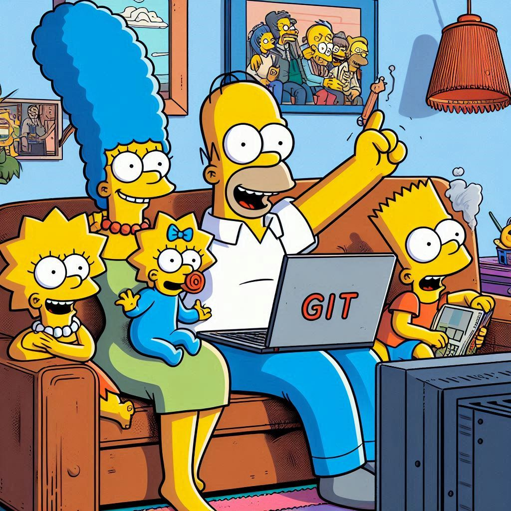

# Taller de Git con Los Simpsons

¡Bienvenidos al **Taller de Git**! Este taller ha sido diseñado para que aprendas las bases del control de versiones de manera práctica y entretenida, en compañía de los icónicos personajes de **Los Simpsons**. Aquí verás cómo dominar Git mientras te diviertes con las aventuras de Springfield.

---

## 🎯 **Objetivo del Taller**

Al finalizar este taller, podrás:

- **Entender y usar Git** como herramienta de control de versiones.
- Colaborar de manera eficiente en proyectos de equipo utilizando Git y GitHub.
- Crear, modificar y administrar ramas para trabajar con mayor flexibilidad.
- Resolver conflictos de código sin perder la cabeza... ni el saxofón de Lisa.
- Integrar las mejores prácticas en tu flujo de trabajo diario.

---

## 📋 **Temas del Taller**

1. **Comandos Básicos con Ralph Wiggum:** Hola, ¡Hola, soy Ralph! No te preocupes, aprenderemos lo básico del terminal. ¡No habrá nada raro como una cebolla en el parque, lo prometo!

2. **Configuración e Inicialización con Marge:** Hola, soy Marge. Configurar Git es como organizar la despensa: una vez que todo está en su sitio, la vida es mucho más fácil. ¡Vamos a evitar que Homer borre todo accidentalmente!

3. **Operaciones Básicas con Homer:** ¡Mmm, comandos básicos de Git! Tan buenos como una cerveza fría después del trabajo. Verás que hacer 'git add' o 'git commit' es como abrir una lata de Duff: una vez que empiezas, no puedes parar."

4. **Ramas y Colaboración con Bart:** ¡Yo soy el Barto! Vamos a liarla con unas cuantas ramas de Git, pero no te preocupes, ¡Lisa nos salvará antes de que se nos vaya todo de las manos!

5. **Uso Avanzado de Git con Lisa:** Soy Lisa Simpson y, como siempre, me toca poner un poco de orden. Aprenderemos técnicas avanzadas para que tu proyecto sea tan eficiente como mi saxofón los domingos por la tarde.

6. **Integración con GitHub con Ned Flanders:** ¡Hola holita, vecinitos! Integrar Git con GitHub es más fácil que una limonada bien fresquita en una tarde de verano. ¡Nada complicado, lo prometo!

7. **Resumen del Taller con Nelson Muntz:** Ha-ha! Soy Nelson y aquí no te escapas sin aprender Git. Repasaremos todo lo que hemos visto porque, ¡eh!, si hasta Milhouse ha aprendido, tú también puedes.

8. **Ejercicios Prácticos con Apu:** ¡Gracias, vuelve pronto! Soy Apu, y no te preocupes, te tengo preparado un surtido de ejercicios prácticos para que domines Git mejor que los precios en el Badulaque.

9. **Feedback con Maggie:** Incluso Maggie tiene algo que decir, ¿por qué no tú? ¡Tu feedback es valioso! Déjanos tus comentarios y sugerencias para que podamos mejorar y hacer que este taller sea todavía más increíble.

---

## ¿Cómo usar la aplicación?

Para ejecutar esta aplicación, sigue estos pasos:

1. **Clona este repositorio:**

   ```bash
   git clone <URL del repositorio>
   cd <nombre del repositorio>

2. **Ejecuta la aplicación**

   ```bash
    streamlit run app_SIMPSONS.py


3. **Accede a la aplicación**

Una vez que ejecutes el comando anterior, Streamlit abrirá automáticamente tu navegador web y podrás acceder a la aplicación en la dirección http://localhost:8501.

---

##  Recursos Adicionales
- Libro Pro Git (gratuito): Una guía completa sobre Git, ideal para usuarios principiantes y avanzados.
- Cheat Sheet de Git: Un resumen práctico de los comandos más usados.
- Git Official Documentation: La documentación oficial para aprender de la fuente.
- Juego interactivo de Git: Practica Git de forma divertida con este juego interactivo.

---

## Contribuciones
¿Tienes ideas para mejorar el taller? ¡Nos encantaría recibir tus contribuciones! Puedes hacerlo de las siguientes maneras:

- Reporta problemas: Abre un Issue en este repositorio.
- Haz mejoras: Envía un Pull Request con tus sugerencias o soluciones.

---

## Agradecimientos
Gracias por ser parte de este taller. Con tu esfuerzo y las enseñanzas de los Simpson, pronto dominarás Git como un verdadero experto. ¡Nos vemos en el repositorio!